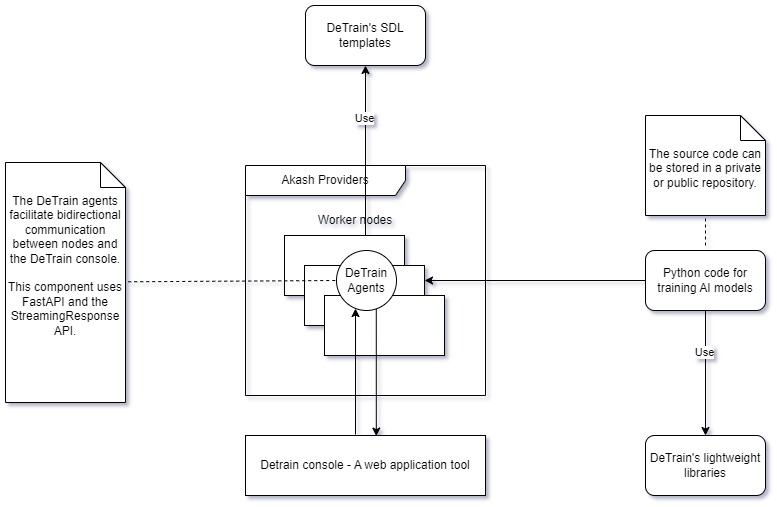
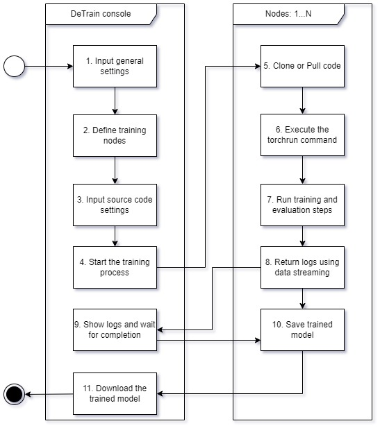

### 0. Vision

Transform into a fully-fledged framework that streamlines distributed training for AI models utilizing Akash Networks marketplace. 

### 1. Overview

Our project embodies the main idea of developing a framework for distributed training and model parallelism (MP). DeTrain includes tools and lightweight libraries using PyTorch to simplify distributed training pipelines

### 2. Demo information 
- [Frontend Application](https://console-detrain.a2n.finance)
- [Video demo]()
- [Github](https://github.com/a2nfinance/detrain)
### 3. Architecture & Features

The DeTrain project comprises four components:
- **DeTrain Python Lightweight Library:** This library, currently in the early development phase, is constructed based on the PyTorch Distributed package and PyTorch RPC package. It simplifies the development of distributed AI model training code by reducing complexity. DeTrain primarily focuses on MP training, with two types: Tensor parallelism (TP) and Pipeline parallelism (PP).
    - To facilitate communication between training nodes in PP training, DeTrain utilizes remote methods of the RPC package
    - For distributed optimization, DeTrain employs distributed autograd and the loss_parallel context
    - To integrate with Data Parallelism (DP), DeTrain utilizes DeviceMesh 2D.
- **Agent:** This component consists of two parts:
    - A Docker image including Python with support for Cuda 11.8, FastAPI, Uvicorn, Gunicorn, and DeTrain libraries
    - A simple software program that assists nodes in communicating with each other and with the DeTrain console.
- **DeTrain Console:** This web application aids developers in designing custom pipelines for training AI models tailored to user-defined infrastructure.
- **Sample SDL Templates & Example Code for Distributed Training Jobs:** This component provides examples to guide developers on how to define infrastructure for PP & TP training.

### 4. How it works

This is the basic workflow of the pipeline building process:

**1. General settings:** Users provide input on the parallel training type, model hyperparameters, and model name.

**2. Infrastructure Definition:** Users define the infrastructure for training, including node addresses, device information **(CPU, GPU)**, port, and communication parameters.

**3. Training Source Code Configuration:** This step involves providing information about the training source code, such as the Git repository, whether it's private or public, destination, and training script path.

**4. Execution Confirmation:** Users confirm their intent to run the training script on the remote nodes. If a user connects to the wallet, all pipeline information will be saved.

**5. DeTrain Console Communication:** The DeTrain Console communicates with all agents of all nodes to obtain the code for training jobs.

**6. Agent Execution:** Agents execute commands to initiate training jobs.

**7. Training & Evaluation Process:** All nodes participate in the training and evaluation process.

**8. Log Transmission:** Logs are sent to the Akash Console application, allowing users to monitor job progress on all nodes. This functionality is implemented using FastAPI and StreamingResponse API.

**9. Process Completion:** Users wait for the process to complete.

**10. Model Saving:** The trained model is saved on a remote node.

**11. Model Download:** Users can download the trained model immediately or at a later time.

### 5. Challenges we ran into

**Challenge 01: Building a Library to Support MP Training**

This task is a real challenge. To understand what needs to be done, there are many concepts and techniques to grasp. It's difficult to find comprehensive documentation or simple libraries focusing on MP training. Most resources prioritize data parallelism (DP) or execute distributed training jobs on a single cluster with multiple devices. PyTorch and Megatron-LM are excellent libraries with extensive support for distributed jobs, but they can be complex for non-expert users. We spent considerable time delving into these libraries and online tutorials to understand their workings. Ultimately, we chose PyTorch, developing utility Python functions to reduce complexity, and tailoring the latest features of Torch 2.3 to support distributed training.

**Challenge 02: Real Environment Testing**

Testing the DeTrain project in a real environment poses multiple challenges due to its multifaceted nature. To ensure compatibility with Akash Providers' machines, we must rigorously test training scripts, remote communication, and Docker images with distributed real CPU/GPU nodes. However, we encountered numerous technical issues and faced testing loops. Some providers offer competitive bids, but their nodes lack stability and high availability. This sometimes led us to believe that our system had bugs, although this wasn't always the case. We decided to test our project on other platforms, such as GCP and AWS, first, and then deploy and retest on Akash Providers' machines. This solution works and reduces the cost of testing.

**Challenge 03: User Experience (UX)**

Creating a user-friendly experience for both developers and general users is highly challenging. Simplifying the implementation of complex tasks and enabling users to utilize tools without mastering all underlying concepts are crucial objectives. This challenge is particularly pronounced in projects related to distributed AI model training, which involve distributed nodes, models, AI concepts, and training with optimization and communication methods. We combine our customized library, SDL template, code examples, and frontend tool with detailed notes and comments. However, our products need more improvements to achieve a better UX.

### 6. Future Development
In this field, there are numerous opportunities for development, and we're considering several important tasks:
- Simplifying DP + TP Training
- Simplifying DP + PP Training
- Reducing Nodes' Communication Overhead
- Implementing Development & Production Modes Separation
- Optimizing Docker Images & Enhancing Security for Agent Software
- Refactoring Code Base

### 7. Conclusion
This hackathon has been a significant challenge for our team. At one point, we even considered halting our work. However, the process of implementing our project has been incredibly educational, keeping us motivated and moving forward. We extend special thanks to Akash Network, hackathon workshops, Akash's open-source resources, and the supportive community on Akash Discord channels. Without their contributions, we wouldn't have been able to complete our product on time.