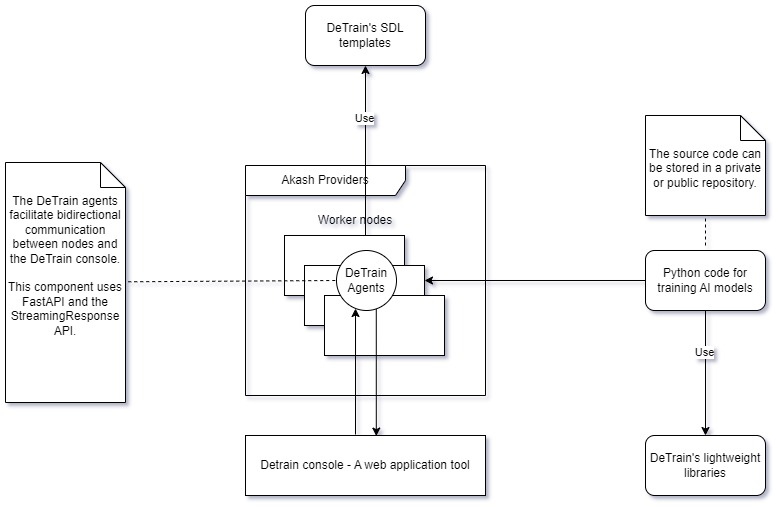

## Introduction

Our project embodies the main idea of developing a framework for distributed training and model parallelism (MP). DeTrain includes tools and lightweight libraries using PyTorch to simplify distributed training pipelines

## Demo information
- [Frontend Application](https://console-detrain.a2n.finance)
- [Video demo]()
- [Docker Image](https://docker.io/library/detrain-nodes)
- [DeTrain python library](https://pypi.org/project/detrain/)


For more detailed information on product features, you can refer to [our project description on Dorahacks.](https://dorahacks.io/buidl/12615)
## Artchitecture


The DeTrain project comprises four components:
- **DeTrain Python Lightweight Library:** This library, currently in the early development phase, is constructed based on the PyTorch Distributed package and PyTorch RPC package. It simplifies the development of distributed AI model training code by reducing complexity. DeTrain primarily focuses on MP training, with two types: Tensor parallelism (TP) and Pipeline parallelism (PP).
    - To facilitate communication between training nodes in PP training, DeTrain utilizes remote methods of the RPC package
    - For distributed optimization, DeTrain employs distributed autograd and the loss_parallel context
    - To integrate with Data Parallelism (DP), DeTrain utilizes DeviceMesh 2D.
- **Agent:** This component consists of two parts:
    - A Docker image including Python with support for Cuda 11.8, FastAPI, Uvicorn, Gunicorn, and DeTrain libraries
    - A simple software program that assists nodes in communicating with each other and with the DeTrain console.
- **DeTrain Console:** This web application aids developers in designing custom pipelines for training AI models tailored to user-defined infrastructure.
- **Sample SDL Templates & Example Code for Distributed Training Jobs:** This component provides examples to guide developers on how to define infrastructure for TP & TP training.

Examples for training are currently included in ```model_parallelism/detrain/examples``` for easy reference. However, they will be maintained in a [different repository](https://github.com/a2nfinance/detrain-example) later on.

## Technology
- For building the DeTrain console:
    - **NextJS** and Ant Design for the frontend.
    - **Akash JS** for interacting with Akash.
    - **Cosmos Kit** for blockchain integration.
    - **Mongoose** for database management.
- For building the Agent software:
    - **FastAPI and StreamingResponse** function for the backend.
    - **Uvicorn and Gunicorn** for ASGI server.
    - **Docker** for containerization.
- For building the DeTrain python library
    - **PyTorch RPC and Distributed packages** for distributed training functionalities.

## Installation

- To run DeTrain console frontend application:
    - ```cd frontend```
    - ```npm i```
    - ```npm run dev``` for the dev mode
    - ```npm run build``` & ```npm run start``` for the production mode.

- To deploy nodes on Akash
    - Go to [Akash console](https://console.akash.network/new-deployment/)
    - Select ```upload SDL```
    - Go to folder ```SDL template```, select one of templates.
    - Change settings and start deployment.
- To customize DeTrain docker image for agents
    - Go to folder ```agent```
    - Modify Dockerfile if you want to add new commands or change the base image
    - To add new function, go to ```main.py``` and add your code block
    - Build new image
    - Push to your docker repository.
## Run examples manually
Ensure that DeTrain library is installed on your machines.

- To test DeTrain python library
    - Go to folder ```model_parallelism/examples```
    - Select what kind of training you want to see
        - PPL: Pipeline parallelism
        - TP: Tensor parallelism
        - FSDP + TP: Full sharding data parallelism + Tensor Parallelism
    - All examples contain logs and evaluation steps, these functions can make training process longer. These files for testing and instruction only.
- Torchrun commands:
    - For PPL training:
    ```
    torchrun --nnodes=3 --nproc_per_node=1 --node_rank=0 --master_addr=localhost --master_port=9999 main.py --gpu="0_0_0" --epochs=2 --batch_size=40 --lr=0.001 --model_name="ppl_04" 
    ``` 
   Node rank is the rank of each node joining the training process. If you have one master node and two GPU worker nodes, you need to run each command for each node with ```node_rank``` values of 0, 1, and 2. The master address is the address of the master node for tensor offloading.

    - For TP and FSDP + TP training:
    ```
    torchrun --nnodes=1 --nproc_per_node=2 --rdzv_id=101 --rdzv-backend=c10d --rdzv_endpoint="localhost:9999" main.py --gpu="0_0_0" --epochs=4 --batch_size=50 --lr=0.001 --model_name="ppl_04"
    ```

    If you have N nodes, rdzv_endpoint is the rendezvous backend endpoint: use ```localhost``` on the master node and use internal IP or public IP on the remaining nodes.

## Run examples using the DeTrain console
Use this tool; you don't need to set up any environment, SSH to a remote node, and run commands manually. Follow these steps:
- Deploy new nodes on Akash cloud.
- Use [DeTrain console](detrain-console.a2n.finance) to create new pipelines.


